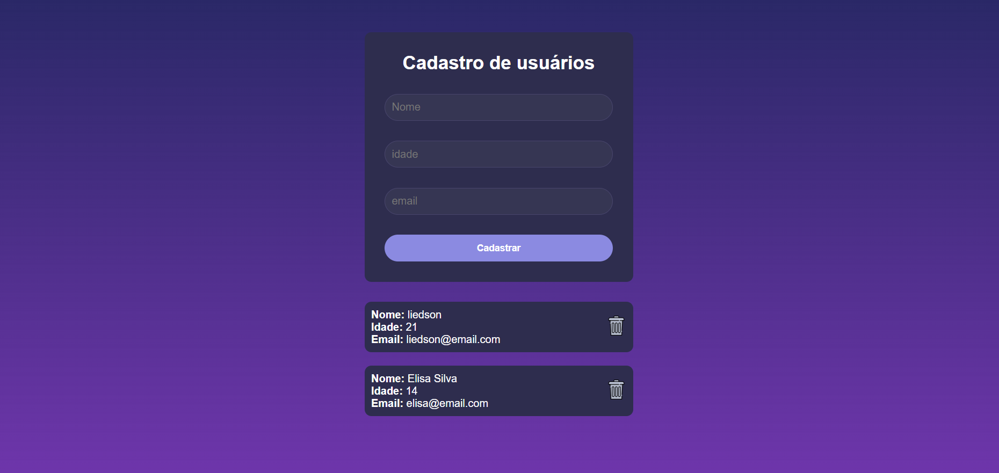

# Cadastro de Usuário

## 📋 Descrição

Projeto de cadastro de usuário, onde é possível inserir informações como nome, idade e email. A aplicação possui integração com back-end e utiliza banco de dados para salvar as informações.

## 🛠️ Tecnologias

- NodeJs
- MongoDB
- ReactJs

## 🌍 Acesse o projeto

Você pode acessar o projeto online clicando no link abaixo:  
👉  [Cadastro de Usuário](https://cadastro-de-usuario-ochre.vercel.app)

## Imagem do projeto
   

